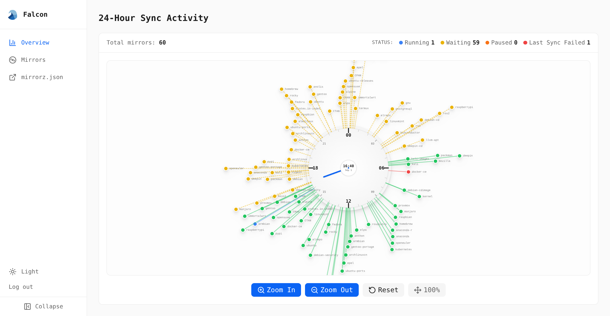

<h1 align="center">
  
  <br>Falcon<br>
</h1>

> [!WARNING]
> Falcon 目前处于开发早期阶段，在 [浙江大学镜像站（ZJU Mirror）](https://mirrors.zju.edu.cn/) 的校内测试站点运行。

Falcon 是一个运行在 [Kubernetes](https://kubernetes.io/) 上的软件源镜像编排器。

- **镜像编排**：每个镜像由一个 `Mirror` CR 声明，内容包括上游、同步周期、存储、发布方式等。控制器据此分配资源（同步 PVC、同步 Job、发布 PVC、Deployment、对外 Route 等），并按周期调度同步任务；`ProxyMirror` CR 以类似的方式描述只代理不同步（可选缓存）的上游。
- **原子化发布**：同步任务成功完成后，基于 VolumeSnapshot 生成不可变的快照，并以快照克隆出只读发布 PVC，滚动替换实例。用户永远不会访问到同步的中间状态。
- **`mirrorz.json`**：符合 [教育网联合镜像站（MirrorZ）](https://github.com/mirrorz-org/mirrorz) 标准。

Falcon 使用 [规范驱动开发（SDD）](https://en.wikipedia.org/wiki/Specification-driven_development)，技术细节见由人工主导编写和维护的 `docs/spec` 下的内容。目前 Spec 仍主要是 AI 生成内容，且代码中可能存在较多防御性编程，正在缓慢整理优化中。



## 快速开始

```sh
helm install falcon oci://ghcr.io/zjusct/charts/falcon \
  -n mirror --create-namespace -f my-values.yaml
```

- 镜像由 `Mirror` CR 描述；字段与示例见 [`docs/spec/mirror.md`](docs/spec/mirror.md)，也可在 [`crds.dev`](https://doc.crds.dev/github.com/ZJUSCT/falcon) 浏览。
- CRD 随 chart 的 crds/ 目录在 install 时安装。helm upgrade 不更新 CRD，需手动 kubectl apply。
- values 结构、RBAC 与部署细节见 [`docs/spec/chart.md`](docs/spec/chart.md)；管理前端见 [`docs/spec/ui.md`](docs/spec/ui.md)。

## 开发检查

提交前必须安装并运行 pre-commit：

```sh
pre-commit install
pre-commit run --all-files
```

仓库的 pre-commit 配置会运行 YAML、Shell、Chart 校验以及完整的 Go 测试套件（`go test ./...`）。CI 使用相同的 Go 测试命令；修改 Go 类型或 CRD 后，请先通过本地 hook 再提交。

## 发布物

| 组件 | 地址 |
| --- | --- |
| 控制器镜像 | `ghcr.io/zjusct/falcon` |
| 管理前端镜像 | `ghcr.io/zjusct/falcon-ui` |
| zfs-agent 镜像 | `ghcr.io/zjusct/zfs-agent` |
| Helm Chart（OCI） | `oci://ghcr.io/zjusct/charts/falcon` |

发版由推送 `v<semver>` git tag 触发 CI 构建全部 Artifacts，chart 版本按规范剥离 `v` 前缀。

## 概念

本项目的文档会使用下面几个词来描述资源的用途、可变性等性质：

- **同步**：可变
- **发布**：镜像内容对用户可见，不可变

下表中的时间戳是同步开始时的 UNIX 时间戳。该时间在控制器创建同步任务时生成，并传播到同步 Job、快照、发布 PVC 等对象的名称中。

| 术语 | Kubernetes 对象 | 含义 |
| --- | --- | --- |
| 同步 PVC | `PersistentVolumeClaim`<br/>`<镜像名>-sync` | 一个镜像唯一可写的数据卷，同步 Job 的输出位置，不用于提供内容 |
| 同步 Job | `Job`<br/>`<镜像名>-sync-<时间戳>` | 运行指定的同步镜像，把上游内容写入同步 PVC |
| 快照 | `VolumeSnapshot`<br/>`<镜像名>-snap-<时间戳>` | 一次成功同步后的同步 PVC 的快照 |
| 活跃快照 | `status.activeSnapshot` | 当前正在对外提供内容的那份快照 |
| 发布 PVC | `PersistentVolumeClaim`<br/>`<镜像名>-snap-<时间戳>` | 从某个快照克隆出的只读数据卷 |
| 活跃发布 PVC | `status.activePVC` | 当前正在对外提供内容的发布 PVC；除它之外的历史发布 PVC 按保留策略随各自快照一起清理 |
| 发布服务 | `spec.publish` 的一个 key | 对外提供内容的方式，目前支持 http 和 rsync |

## TODO

已经整理完成的 Spec：

- `common.md`
- `mirror.md`

等待做的：

- Spec 全部整理
- chart 和 pre-commit hook 等的校验完善
- e2e 测试 CI 化
- Before the next OpenEBS ZFS LocalPV release: enable snapshotter creation metadata, verify ZFS annotations, and align Falcon zfs-agent handling

## 与同步工具/容器的关系

同步的行为取决于具体的同步工具。Falcon 作为编排器，尽可能在这方面为各工具留出可配置的空间。

我们实际使用过 [tuna/tunasync-scripts](https://github.com/tuna/tunasync-scripts) 和 [ustclug/ustcmirror-images](https://github.com/ustclug/ustcmirror-images)，这里记录一些使用经验。

### tunasync-scripts

TUNA 为裸机服务。该仓库由每个上游一个的独立同步脚本组成，Python、Shell Script 各半。这些脚本一致性较好，都按照 tunasync 的设计编写：

- env 稳定：
    - `TUNASYNC_WORKING_DIR`：内容输出目录
    - `TUNASYNC_UPSTREAM_URL`：上游地址
- 日志：
    - 输出统一：`echo` 到 stdout，能够由 K8s 可观测性基础设施直接收集
    - 格式统一：`%Y-%m-%dT%H:%M:%S - 文件:行号 [级别] 消息`
- 退出码：脚本默认宽容部分同步的退出码，tunasync worker 除退出码外还按 `failOnMatch` 正则扫描日志判败

### ustcmirror-images

USTC 全面容器化。不同的同步容器约定不同，但文档详尽。有大致统一的框架：

- 在 `base` 镜像中固定 entry 为 `upstream.sh`、`pre-sync.sh`、`sync.sh` 等一系列固定流程
- 日志统一文件写入 `/log`

## 许可证

[Apache-2.0](LICENSE)
